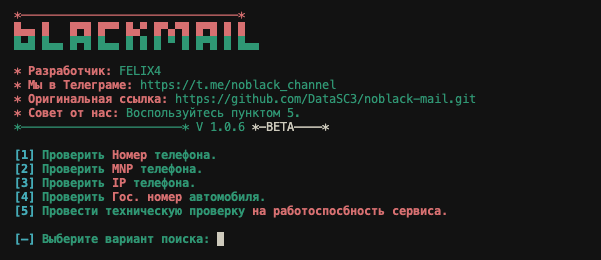

<meta property="og:title" content="noblack-mail">
<meta property="og:description" content="Поисковой сервис данных, по номеру телефона. От команды «NOBLACK».">
<meta property="og:image" content="src/banner.png">
<meta name="author" content="FELIX4">
<meta name="keywords" content="noblack-mail, поиск по номеру телефона, пробив">

# 🔥 **NOBLACK-MAIL v:1.0.7** BETA 🔥

### **🔖 Новая версия:**
    * Поиск данных по номеру телефона;
    * Поиск MNP данных телефона;
    * Поиск IP данных телефона;
    * Получение открытых конф. данных;
    * Получение рейтинга.
    —— 2023

### **🌟 Что нового:**
    * Техничесткая проверка;
    * Автоматическое обновление;
    * Устаранение ошибок.
    —— NEW

### **💼 Правообладатель:**
    * Разработчик: FELIX4
    * Команда: noblack.command
    * Канал: noblack_channel
    —— TELEGRAM

### **📑 Отказ от ответственности:**
    Мы, команда разработчиков, хотим обратить ваше внимание на то, что использование данного приложения несет определенные риски и может привести к негативным последствиям.

    Приложение noblack-mail предназначено для получении данных с открытых источников.

    Мы не несем ответственности за использование данного приложения в незаконных целях или для нарушения прав и свобод других лиц.
    —— LICENSE

---
## **📱 Termux:**
```Bash
1. pkg update -y && upgrade -y
2. pkg install git -y python3 -y
3. pkg install python3-pip
4. pkg install openssl
5. pip install requests bs4 
6. git clone https://github.com/DataSC3/noblack-mail.git
7. cd noblack-mail
8. python3 noblack-mail.py
```

##### ИЛИ МОЖЕТЕ СКОПИРОВАТЬ ЭТО, И ВСТАВИТЬ. 
```Bash
pkg update -y && upgrade -y && pkg install git -y python3 -y && pkg install python3-pip && pkg install openssl && pip install requests bs4 && git clone https://github.com/DataSC3/noblack-mail.git && cd noblack-mail && python3 noblack-mail.py
```
---
## **💻 Linux:**
```Bash
1. sudo apt-get install git 
2. sudo apt-get install python3
3. pip3 install requests bs4 
4. git clone https://github.com/DataSC3/noblack-mail.git
5. cd noblack-mail
6. python3 noblack-mail.py
```

##### ИЛИ МОЖЕТЕ СКОПИРОВАТЬ ЭТО, И ВСТАВИТЬ. 
```Bash
sudo apt-get install git && sudo apt-get install python3 && pip3 install requests bs4 && git clone https://github.com/DataSC3/noblack-mail.git && cd noblack-mail && python3 noblack-mail.py
```

## **🌀 Debian:**
```Bash
1. sudo apt-get install git 
2. sudo apt-get install python3
3. pip3 install requests bs4 
4. git clone https://github.com/DataSC3/noblack-mail.git
5. cd noblack-mail
6. python3 noblack-mail.py
```

##### ИЛИ МОЖЕТЕ СКОПИРОВАТЬ ЭТО, И ВСТАВИТЬ. 
```Bash
sudo apt-get install git && sudo apt-get install python3 && pip3 install requests bs4 && git clone https://github.com/DataSC3/noblack-mail.git && cd noblack-mail && python3 noblack-mail.py
```

## **👾 Arch:**
```Bash
1. sudo pacman -Syu python git
2. pip3 install requests bs4
3. git clone https://github.com/DataSC3/noblack-mail.git
4. cd noblack-mail
5. python3 noblack-mail.py
```
sudo pacman -Syu git python3 && pip3 install requests bs4 && git clone https://github.com/DataSC3/noblack-mail.git && cd noblack-mail && python3 noblack-mail.py
##### ИЛИ МОЖЕТЕ СКОПИРОВАТЬ ЭТО, И ВСТАВИТЬ.
```Bash
sudo pacman -Syu git python3 && pip3 install requests bs4 && git clone https://github.com/DataSC3/noblack-mail.git && cd noblack-mail && python3 noblack-mail.py
```

---
## **🖥 Windows (cmd):**
- Установите Python 3:\
[Скачать Python можно тут.](https://www.python.org/downloads/)  ВАЖНО: поставьте галочку **"Add to PATH"** при установке, после установки, откройте консоль и введите:

```Bash
pip install requests bs4
```
---

## **⚙️ Запуск:**
- Скачайте [репозиторий](https://github.com/DataSC3/noblack-mail/archive/master.zip) и распакуйте в удобное место.

- Перейдите в папку со скриптом откройте в этой папке консоль `Shift + ПКМ`
- Запустите скрипт командой `python noblack-mail.py`

---

